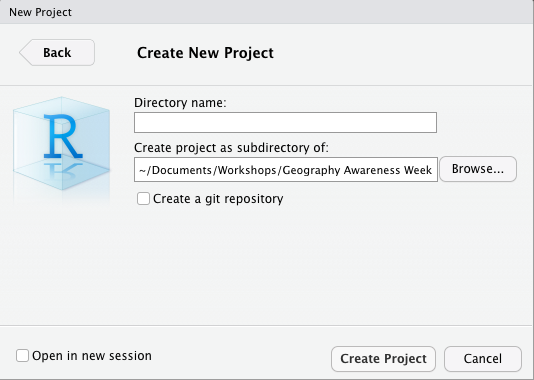
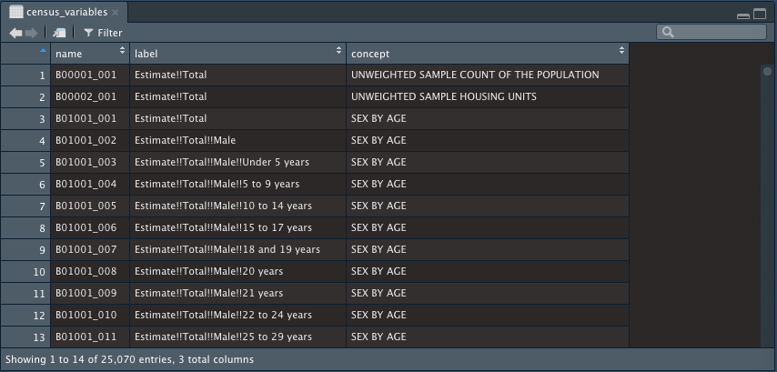

```{r setup, include=FALSE}
knitr::opts_chunk$set(echo = TRUE)
```

## Scenario
*You are working for a local non-profit organization, Caring for Seniors, which focuses on senior citizens and/or their caretakers and your boss wants you to create an interactive web maps that shows the number of long term care facilities along with some demographic information such as the disabled population over 65 years old. Previously, you saw a leaflet map and you were really impressed by it. You decided that it would be a good idea to use leaflet using R to make this web map.* 


## Units
### Unit 1: Mapping Point Data in Leaflet
### Unit 2: Mapping Polygon Data in Leaflet

***


## Unit 1: Mapping Point Data in Leaflet
### Unit Objectives
1. Setting up your RStudio workspace.
2. Loading shapefiles (points) in RStudio and mapping point data in leaflet.
3. Adding pop-ups and labels to your leafet map.

### Terms to know
- **RStudio**: An Integrated Development Environment (IDE) for R. An IDE is a software application that provides a graphic interface for programming. By doing so, it allows for a more productive workflow.
- **RProject**: A workspace which contains all of the various documents you created in RStudio.
- **working directory**: The directory that RStudio will refer to when loading and processing data.
- **chloropleth map**: A map that shows the differences in values through shades, colors, 
or patterns.
- [pipe operator (%>%)](https://magrittr.tidyverse.org/): An operator that allows you to transfer the information from one previous operation to another. This cuts down on redundancy in calling functions and assigning variables. 
- [cartographic boundary shapefile](https://www.census.gov/geographies/mapping-files/time-series/geo/carto-boundary-file.html): These are simplified representations of the Census 
Bureau's TIGER shapefiles. 

#### Lesson 1: Setting up your RStudio workspace
Let's begin by setting up your RStudio workspace! It's important to establish a workspace which will allow you
to easily manage your workflow. By setting up a structure for everything in advance, it will save you a lot of 
pain in the long run!

1. The first thing you want to do is to open up RStudio and create a new project. You can do that by opening  RStudio and go to **File -> New Project -> New Directory**

2. Under **Create New Project**, choose the directory where you want your project to be in and name your sub-directory. It is highly recommended to save all of your files under your project subdirectory.



3. Go to **File -> New File -> R Script**. 

4. Go to **File -> Save As** and name your newly created R script **leafletmap**.

5. As mentioned in the Introduction, make sure you install and load these packages:

```{r, eval = FALSE}
#installing required packages
install.packages("leaflet")
install.packages("tidycensus")
install.packages("tidyverse")
install.packages("rgdal")
install.packages("sf")
install.packages("rmarkdown")
install.packages("magrittr")

#loading required packages
library(leaflet)
library(tidycensus)
library(tidyverse)
library(rgdal)
library(sf)
library(rmarkdown)
library(magrittr)
```
 
6. For the Unit 2, we will need to access the US Census API. Let's go ahead and do that. Make sure to put your
API Key here:

```{r eval = FALSE}
census_api_key("ENTER API KEY HERE")

```

7. In your R Project folder, create a folder named **Data**. Download your shapefiles and unzip them in your Data folder.

8. There's one more step. You need to set a working directory. Go to **Session -> Set Working Directory**. You
can either choose your Project Directory or choose a directory of your choice. I recommend that you choose your 
project directory as your working directory.

Now you're ready to go!

#### Lesson 2: Loading shapefiles(points) in RStudio and mapping data to leaflet
 The first thing that you're wanting to do is to load the shapefiles into RStudio. The rgdal package will allow you to do this. 

1. Let's load the long-term care facilities into R Studio:
```{r eval = FALSE}
ltc_facilities <- readOGR("Data/SLC_LTC_Facilities/slc_ltc_facilities.shp", verbose = FALSE)

```
`verbose = FALSE` suppresses any warning messages that would occur when running your code.

2. Now we're going to create a leaflet map! We are going to use pipes (%>%) in order to streamline our processes
when creating the map. The pipe allows you to focus on the processes as opposed to having to constantly assign variables and constantly call functions with variables. You are essentially getting rid of a lot of redundancy by using pipes. Each pipe passes the information from the previous operation or function to the next operation or function. Let's try adding just the long term care facilities.

```{r eval= FALSE}
ltc_facilities <- readOGR("Data/SLC_LTC_Facilities/slc_ltc_facilities.shp",
                          verbose = FALSE)
leaflet() %>%
  addTiles() %>%
  addMarkers(data = ltc_facilities, lng = ~LONGITUDE, lat = ~LATITUDE)
```


```{r eval = TRUE, echo = FALSE, message = FALSE}
library(leaflet)
library(magrittr)
library(rgdal)
library(sf)


ltc_facilities <- readOGR("./dataprep/SLC_LTC_Facilities/slc_ltc_facilities.shp",
                          verbose = FALSE)
leaflet() %>%
  addTiles() %>%
  addMarkers(data = ltc_facilities, lng = ~LONGITUDE, lat = ~LATITUDE)
```

The long term care facilities should  be loaded on the map.


`addTiles()` adds a base map layer. You can change the base map if you wish, but we won't for the sake of this lesson! `addMarkers()` is the function that allows you to add the markers lng and lat refers to the longitude and latitude of the data points. 

The long term care facilities should  be loaded on the map.


#### Lesson 3. Adding pop-ups and labels to your leafet map.

All you need to do to add pop-ups and labels to your leaflet map is to add some parameters in the 
addMarkers() function. There is another method to make your pop-ups specialized by 
```{r eval = FALSE}
leaflet() %>%
  addTiles() %>%
  addMarkers(data = ltc_facilities, lng = ~LONGITUDE, lat = ~LATITUDE, 
             popup = as.character(ltc_facilities$FACILITY),
             label = as.character(ltc_facilities$FACILITY))
```

```{r eval = TRUE, echo = FALSE, message = FALSE}
library(leaflet)
library(magrittr)
library(rgdal)
library(sf)


ltc_facilities <- readOGR("./dataprep/SLC_LTC_Facilities/slc_ltc_facilities.shp",
                          verbose = FALSE)
leaflet() %>%
  addTiles() %>%
  addMarkers(data = ltc_facilities, lng = ~LONGITUDE, lat = ~LATITUDE, popup = as.character(ltc_facilities$FACILITY),
             label = as.character(ltc_facilities$FACILITY))
```


***


## Unit 2: Mapping Polygon Data in Leaflet
### Unit Objectives
1. Downloading census data to polygons via tidycensus package.
2. Loading polygons in Leaflet.
3. Doing basic data manipulation using the mutate function in the dplyr package.
4. Adding the polygon to your leaflet map.
5. Adding interactivity to your map.

### Terms to know
- [dplyr](https://dplyr.tidyverse.org/): A package that provides a set of commands, known as verbs, 
that allows you to do basic data manipulation.


#### Lesson 1: Downloading census data to polygons via the tidycensus package.

Now that we added some points, we want to add some relevant socio-economic variables which will allow
your map to tell a more in-depth story to the users. The socioeconomic variables that we are concerned 
with here is the percentage of individuals over the age of 65 with disabilities. Since the US Census
bureau separates the data by sex, we are going to have to do some basic data manipulation.

1. To know which variables we need, we need to use tidycensus download a data table with all the available variables. We can then search for the variables we want and then use tidycensus to obtain those variables.

```{r eval = FALSE}
census_variables <- load_variables(2017, "acs5", cache = TRUE)
```

2. Under the **Data** section under the **Environment** panel, click on census_variables and a data table will open up.



You can use the search box on the top-right corner of the data table to look up the variables we need.
You will be using the variables **name** field to enter in a tidycensus search.

3. Here are the variables that we are interested in:
```{r eval = TRUE, echo = FALSE}
library(DT)

df <- data.frame("name" = c("B18101_00", "B18101_016", "B18101_019", "B18101_035", "B18101_038"),
                              "label" = c("Total Population", "Estimate- Total Male 65 to 74 years old with a
                              disability", "Estimate - Totale Male 75 years and older with a disability",
                              "Estimate - Total Female 65 to 74 years with a disability", "Estimate - Total
                              Female 75 years and over with a disability"),
                              "concept" = c("Sex and Age by Disability Status", "Sex and Age by Disability  
                              Status", "Sex and Age by Disability Status", "Sex and Age by Disability Status",
                              "Sex and Age by Disability Status"))

datatable(df, options = list(dom = 't')) 
```
Take note of these, since you will have to use them in your search.

4. Since we are going to need to manipulate the data that we downloaded using the pipe operator, there are going to be two components with this step.  First, we are going to download the data from the US Census API using tidycensus, and then we are going to add some of the variables together to get the total population by adding together the male and female populations.

```{r eval = FALSE}
stlouis_disabled <- get_acs(geography = "tract", 
                   variables = c("B18101_001", "B18101_016", "B18101_019",
                                 "B18101_035", "B18101_038"), state = "MO", 
                            county = "510", geometry = TRUE, output = "wide") %>%
  #the pipe operation above moves the variables from the previous operation to the next 
  #operation which is to sum up all of the total populations by sex.
  mutate(totalpop = B18101_016E + B18101_019E+ B18101_035E + B18101_038E,
          percent_disb = (totalpop/B18101_001E)*100)


```

The mutate function is a function that is in the dplyr package, which is used for data manipulation. You don't need to install and load this package, for it is a part of the tidyverse package that you already installed and loaded.  Mutate allows you to create a new variable and add it to your data table.
Totalpop is the sum of all of the total populations by sex and percent_disb is the percentage of individuals with disabilities in each census tract. When creating chloropleth maps, you should never map absolute values because such values are not standardized. For example, if two tracts have a population of 10 people with disabilities, the ten people could be ten out of 50 or ten out of 100 people. It is important to standardize values when using chloropleth maps. 

stlouis_disabled is saved as a cartographic boundary shapefile which we can map in leaflet. Let's go ahead and do that!


#### Lesson 4: Adding the polygon to your leaflet map  

1. Let's go ahead and add the polygon to your leaflet map. First we need to choose a color palette for our polygons which best shows the percentage of disabled individuals per census block. You can choose from a list of available
color palettes [here](https://moderndata.plot.ly/create-colorful-graphs-in-r-with-rcolorbrewer-and-plotly/). This link also gives more information on the best use of types of color palettes.

```{r eval = FALSE}

pal = colorNumeric(palette = "viridis", domain = stlouis_disabled$percent_disb)

```

I decided to choose viridis which is a very popular and accessible color palette for data visualization.

2. Let's go ahead and add the polygons to our map!
```{r eval = FALSE}

map <- leaflet() %>%
  addTiles() %>%
  addMarkers(data = ltc_facilities, lng = ~LONGITUDE, lat = ~LATITUDE, label = ltc_facilities$FACILITY) %>%
  addPolygons(data = stlouis_disabled, fillOpacity = 0.4, stroke = FALSE, color = ~pal(percent_disb)) 
map
```

```{r, include = FALSE}
library(leaflet)
library(tidycensus)
library(tidyverse)
library(rgdal)
library(sf)
library(rmarkdown)
library(magrittr)

ltc_facilities <- readOGR("./dataprep/SLC_LTC_Facilities/slc_ltc_facilities.shp",
                          verbose = FALSE)

census_api_key("e758b8cf88c937a42cd051ff1ecfb2bb0d1fec41")

stlouis_disabled <- get_acs(geography = "tract", 
                   variables = c("B18101_001", "B18101_016", "B18101_019",
                                 "B18101_035", "B18101_038"), state = "MO", 
                            county = "510", geometry = TRUE, output = "wide") %>%
  #the pipe operation above moves the variables from the previous operation to the next 
  #operation which is to sum up all of the total populations by sex.
  mutate(totalpop = B18101_016E + B18101_019E+ B18101_035E + B18101_038E,
          percent_disb = (totalpop/B18101_001E)*100)

```

```{r eval = TRUE, echo = FALSE, message = FALSE, warning = FALSE}

pal = colorNumeric(palette = "viridis", domain = stlouis_disabled$percent_disb)

map <- leaflet() %>%
  addTiles() %>%
  addMarkers(data = ltc_facilities, lng = ~LONGITUDE, lat = ~LATITUDE, label = ltc_facilities$FACILITY) %>%
  addPolygons(data = stlouis_disabled, fillOpacity = 0.4, stroke = FALSE, color = ~pal(percent_disb)) 
map
```


With the `addPolygons()` function, we specified the data source and gave some opacity to the polygon so we can see the basemap under the polygon. We also got rid of any census tract borders(`stroke = FALSE`), and set the color palette. We're not done yet! Even though we have everything mapped, which census tracts have a low percentage of individuals with disabilities and which tracts have a high percentage of individuals with disabilities? 

3. In order to figure out what the colors represent, we're going to have to create a legend. 

```{r  eval = TRUE, echo = TRUE, message = FALSE, warning = FALSE}

map <- leaflet() %>%
  addTiles() %>%
  addMarkers(data = ltc_facilities, lng = ~LONGITUDE, lat = ~LATITUDE, label = ltc_facilities$FACILITY) %>%
  addPolygons(data = stlouis_disabled, fillOpacity = 0.4, stroke = FALSE, color = ~pal(percent_disb),
              popup = stlouis_disabled$NAME) %>%
  addLegend(data = stlouis_disabled, pal = pal,  values = ~stlouis_disabled$percent_disb, opacity = 1,
            position = "bottomright", title = "Disabled Population", 
            labFormat = labelFormat(suffix = "%"))
map
```

In the addLegend function, we specified the data, the color palette, the values that were mapped, the opacity, and the position. In addition, we added a title and made sure that % was listed after each number through adding a suffix. I also added pop-ups so the viewers of the map can be able to identify the 
census tracts.

#### Lesson 5: Adding interactivity to your map

Let's add some interactivity to the map. It'll be best for the users of the map to be able to turn and off the layers.

```{r  eval = TRUE, echo = TRUE, message = FALSE, warning = FALSE}
map <- leaflet() %>%
  addTiles() %>%
  addMarkers(data = ltc_facilities, lng = ~LONGITUDE, lat = ~LATITUDE, label = ltc_facilities$FACILITY,
             group = "Long Term Care Facilities") %>%
  addPolygons(data = stlouis_disabled, fillOpacity = 0.4, stroke = FALSE, color = ~pal(percent_disb),
              group = "Percentage of Population", popup = stlouis_disabled$NAME) %>%
  addLegend(data = stlouis_disabled, pal = pal,  values = ~stlouis_disabled$percent_disb, opacity = 1,
            position = "bottomright", title = "Disabled Population", 
            labFormat = labelFormat(suffix = "%")) %>%
  #We will add the layer control here
  addLayersControl(
    overlayGroups = c("Long Term Care Facilities", "Percentage of Population"),
    options = layersControlOptions(collapsed = FALSE))

map
```
In order to turn the layers on and off, you need to put your layers into groups. You will assign the groups to turn on and off in the overlayGroups function. `c()` contains the vector of characters and you should use this if you have more than one group.

Congratulations! You just created your first leaflet map in R! Now let's work on learning how to 
publish the map in order to reach a variety of stakeholders!
