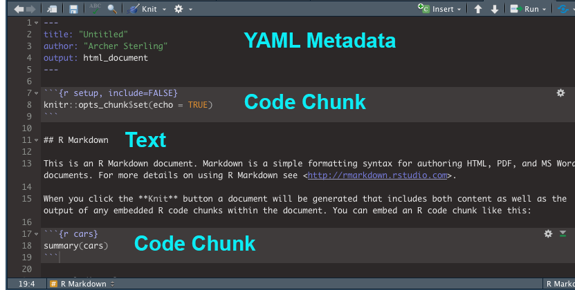

```{r setup, include=FALSE}
knitr::opts_chunk$set(echo = TRUE)
```
## Scenario
*You finished making your map showing the number of long term care facilities and the percentage of the disabled population by census tract. Now, you're ready to show off your map to interested stakeholders!*

## Units
### Unit 1: Introduction to R Markdown
### Unit 2: Putting your Leaflet Map in R Markdown 


***

## Unit 1: Introduction to R Markdown
### Unit Objectives
- To gain a basic familiarity with R Markdown.
- To embed a leaflet map in an R Markdown document.

### Terms to Know
- **RMarkdown**: An authoring framework which allows you to create a variety of documents such as presentations, webpages, and html documents.

-  **YAML**: Stands for "YAML Ain't Markup Language". YAML is a user-friendly and readable data serialization language for a variety of programming languages.

## Lesson 1: Becoming familiar with R Markdown

R Markdown is a framework in which you can make dynamic documents and make your research reproducible. R Markdown documents have three parts which are composed of the text that make up the documents, the code chunks that either static, automatic, or run based on a user prompt. Finally, there's the YAML metadata which gives you information about the document. The YAML is optional, so feel free to not add it if you don't need it.

You have many options when it comes to creating R Markdown documents such as creating websites, slides, and dashboards. For today's lesson, we will just create a simple R Markdown document that embeds your leaflet map. For more specific information on R Markdown, you can refer to this [cheat sheet](https://rstudio.com/wp-content/uploads/2015/02/rmarkdown-cheatsheet.pdf) on
R Markdown.


Let's make an R Markdown document! Go to **File -> New File -> R Markdown** to open
an R Markdown document. Fill in the information in the "title" and "author" fields and keep the default output format to HTML. Clear everything in the document with two exceptions:
 - The code chunk which includes: `knitr::opts_chunk$set(echo = FALSE)`
 - The YAML data which is delinated by an `---`



#### Lesson 2: Getting Familiar with R Markdown Syntax


Now that you created your RMarkdown document, let's get a little bit familiar with the R Markdown syntax. We'll go over how to create headers and to change your text. If you want to know more of the syntax, refer to the cheat sheet that was previously mentioned. We're just learning just enough to give your map a title and to include information! 

##### Creating Headers

# This is Header 1
`# This is Header 1`

## This is Header 2
`## This is Header 2`

### This is Header 3
`### This is Header 3`

See a pattern?

##### Changing Text

*This is italicized* `*this is italicized*`

**This is bold** `**this is bold**`


## Unit 2: Embedding your Leaflet Map in R Markdown
### Unit Objectives
- To insert code chunks into R Markdown.
- To embed a leaflet map in an R Markdown document.
- To publish an R Markdown document on RPubs.

### Terms to Know
**absolute file path**: The complete directory information for your file. Using absolute file paths are 
discouraged because it keeeps your code from being reproducible.

**relative file path**: Refers to the location of a file that is relative to the current directory. Relative
file paths are donated by a `.` or `..` `.` represents the current directory and `..` represents going up one level in the directory.


#### Lesson 1: Inserting code chunks into R Markdown

One nice thing about R Markdown is that you can embed and run code chunks in your 
document. We can do this by creating a code chunk section:

1. In your R Markdown document window area, you can also click on the **Insert** button
on the top menu bar of your workspace  and click on **R**.  Do this two times total for we're going to create a code chunk that contains the code for the preprocessing and another code chunk that includes the code for the leaflet map.


2. The first code chunk will be your preprocessing code chunk. maybe sure to format your code chunk in 
this manner:
`{r, include = FALSE}`
`include = FALSE` allows for for the code to be ran, but you will not see any output or output messages.

Include all of the preprocessing tasks, which includes loading the libraries, loading the points shapefile through `readOGR`, and obtaining the polygon shapefile using tidycensus. You will also set the color palette for the polygon shapefile here. There are two things that you need to know when using `readOGR()`. First, make sure to include the full file path of the shapefile when using `readOGR()`. If you are using a Mac, you can get the full file path by holding down option and right clicking on the shopefile (the file with the .shp extension). You should see an option to copy by pathname. Another thing you need to know is that even though you turned off seeing processing messages in your r chunk, unfortunately, it did not remove all the processing messages. You're going to have to add a parameter in the `readOGR()` functionso you can suppress the processing message of when the function loads the shapefile. Add `verbose = FALSE` to the readOGR function.

```{r, include = FALSE}
library(leaflet)
library(tidycensus)
library(tidyverse)
library(rgdal)
library(sf)
library(rmarkdown)
library(magrittr)

ltc_facilities <- readOGR("./Data/SLC_LTC_Facilities/slc_ltc_facilities.shp",
                          verbose = FALSE)

census_api_key("e758b8cf88c937a42cd051ff1ecfb2bb0d1fec41")

stlouis_disabled <- get_acs(geography = "tract", 
                   variables = c("B18101_001", "B18101_016", "B18101_019",
                                 "B18101_035", "B18101_038"), state = "MO", 
                            county = "510", geometry = TRUE, output = "wide") %>%
  #the pipe operation above moves the variables from the previous operation to the next 
  #operation which is to sum up all of the total populations by sex.
  mutate(totalpop = B18101_016E + B18101_019E+ B18101_035E + B18101_038E,
          percent_disb = (totalpop/B18101_001E)*100)

pal = colorNumeric(palette = "viridis", domain = stlouis_disabled$percent_disb)


```


```{r, echo= TRUE, eval = FALSE}
library(leaflet)
library(tidycensus)
library(tidyverse)
library(rgdal)
library(sf)
library(rmarkdown)
library(magrittr)

ltc_facilities <- readOGR("./YOUR_FILE_PATH/slc_ltc_facilities.shp",
                          verbose = FALSE)

census_api_key("YOUR_API_KEY")

stlouis_disabled <- get_acs(geography = "tract", 
                   variables = c("B18101_001", "B18101_016", "B18101_019",
                                 "B18101_035", "B18101_038"), state = "MO", 
                            county = "510", geometry = TRUE, output = "wide") %>%
  #the pipe operation above moves the variables from the previous operation to the next 
  #operation which is to sum up all of the total populations by sex.
  mutate(totalpop = B18101_016E + B18101_019E+ B18101_035E + B18101_038E,
          percent_disb = (totalpop/B18101_001E)*100)
```

Make sure to use your computer's relative file path when you're loading the points shapefile into R Studio as opposed to using absolute paths. For your information about relative paths, you can go [here](http://personal.colby.edu/personal/m/mgimond/RIntro/01_The_R_environment.html). 
[R for Data Science](https://r4ds.had.co.nz/workflow-projects.html) also goes into detail on absolute and 
relative paths.

4. Make sure to format your second code chunk in this manner:
`{r, eval = TRUE, echo = FALSE, message = FALSE, warning = FALSE}`

When you set `eval = TRUE` it means that you want to evaluate the code and include
its results and when you set `echo = FALSE`, you want to hide the code. `message = FALSE` hides most of the
processing messages and `warning = FALSE` hides the warning messages.


#### Lesson 2: Embedding a leaflet map into R Markdown


1. Now it's time to add the code used to create your leaflet map to your code chunk. Let's also add a Header 2 title above the code chunk to give a title for your map. Let's call it "Long Term Care Facilities and 
Percentage of Disabled Population above 65 Years Old in St. Louis." Put this in the **title** section 
on the top of your R Markdown document. Make sure that you list yourself as the author. To see your final product, click the **Knit** button near the top left-hand corner of your workspace and click on **Knit to HTML** on the dropdown menu. This will turn your R Markdown document into an HTML file.

```{r, echo = TRUE, eval = FALSE}
map <- leaflet() %>%
  addTiles() %>%
  addMarkers(data = ltc_facilities, lng = ~LONGITUDE, lat = ~LATITUDE, label = ltc_facilities$FACILITY,
             group = "Long Term Care Facilities") %>%
  addPolygons(data = stlouis_disabled, fillOpacity = 0.4, stroke = FALSE, color = ~pal(percent_disb),
              group = "Percentage of Population", popup = stlouis_disabled$NAME) %>%
  addLegend(data = stlouis_disabled, pal = pal,  values = ~stlouis_disabled$percent_disb, opacity = 1,
            position = "bottomright", title = "Disabled Population", 
            labFormat = labelFormat(suffix = "%")) %>%
  #We will add the layer control here
  addLayersControl(
    overlayGroups = c("Long Term Care Facilities", "Percentage of Population"),
    options = layersControlOptions(collapsed = FALSE))

map

```

## Long Term Care Facilities and Percentage of Disabled Population above 65 Years Old in St. Louis

```{r,  eval = TRUE, echo = FALSE, message = FALSE, warning = FALSE}

map <- leaflet() %>%
  addTiles() %>%
  addMarkers(data = ltc_facilities, lng = ~LONGITUDE, lat = ~LATITUDE, label = ltc_facilities$FACILITY,
             group = "Long Term Care Facilities") %>%
  addPolygons(data = stlouis_disabled, fillOpacity = 0.4, stroke = FALSE, color = ~pal(percent_disb),
              group = "Percentage of Population", popup = stlouis_disabled$NAME) %>%
  addLegend(data = stlouis_disabled, pal = pal,  values = ~stlouis_disabled$percent_disb, opacity = 1,
            position = "bottomright", title = "Disabled Population", 
            labFormat = labelFormat(suffix = "%")) %>%
  #We will add the layer control here
  addLayersControl(
    overlayGroups = c("Long Term Care Facilities", "Percentage of Population"),
    options = layersControlOptions(collapsed = FALSE))

map


```


***
#### Lesson 3: Publishing and RMarkdown document on RPubs.
Now you're at the final step! It's time to show off what you've done! There are various ways to share
your map online, but one of the easiest ways of doing so is through RPubs. You can sign up for an account [here](www.rpubs.com). Once you sign up, you will easily be able to publish your document on RPubs.

1. Knit your document to HTML if you already haven't done so. On the top right of your HTML document, you 
should see a button that says **Publish** on the top right-hand corner of your document. Click it, and you will be prompted to log in. Before you get the prompt, some additional R packages might automatically download. Once they are finished downloading, you will be able to log in.

2. Once you log in, you will be directed to a page where you will need to enter a title and information about your document. You can also give your document a semi-customized web address if you want. Be aware that your map will be publicly available, so keep that in mind when coming up with a summary of your map! 
