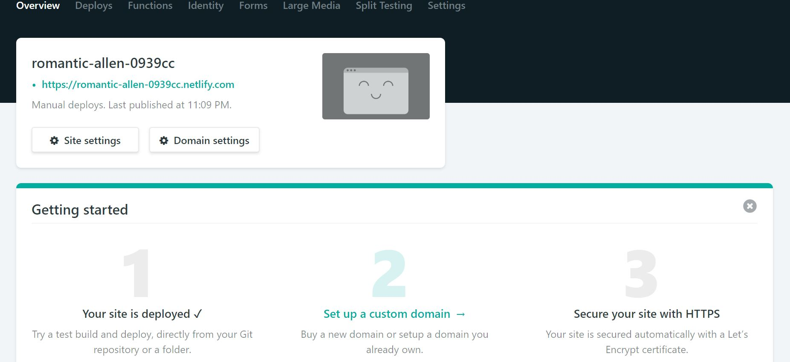
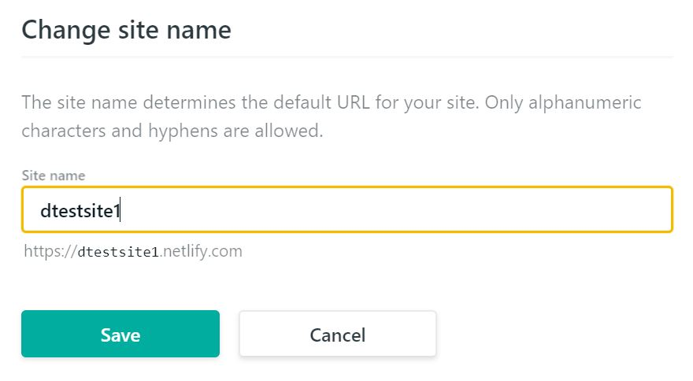

# Unit 2: Making a blogdown site

## Unit Learning Objectives
- To become familiar with blogdown.
- To have a basic understanding of the Hugo static site generator.
- To understand how to deploy a blogdown site.

## Unit Difficulty
Beginner. This is a little more difficult from Unit 1 since you will be using TOML to configure your site. 

## Terms to Know for Unit 2

<b>blogdown</b>: A [package](https://github.com/rstudio/blogdown) that allows you to create static websites using R Markdown.

<b>TOML</b>: Stands for "Tom's Obvious Minimal Language". [TOML](https://github.com/toml-lang/toml) is an easy to read format that parses(reads) in data structures for a variety of programming languages.

<b>Hugo</b>: A fast static website engine that is written in the Go programming language which was created by [bep](https://github.com/bep), [spf13](https://github.com/spf13), and [other contributors](https://github.com/gohugoio/hugo/graphs/contributors).

<b>static website generator</b>: A generator that renders content on a website using flat files as opposed to databases. This results in fast rendering of webpages which takes a fraction of the memory. 

<b>dynamic website generator</b>: A generator that renders content on a website using databases and queries. This allows the website to use real-time data or customize to the user.

### Lesson 1: Introduction to blogdown
Blogdown is a package in which which you can make static web sites using R Markdown. What are static websites do you ask? I won't get deep into it, but a static website differs from a dynamic website generator is that it doesn't use queries and databases like a dynamic database does. Instead, it uses flat files which allows for your website to be rendered quickly. Static site generators take the content, apply it to a chosen template, and generates HTML pages pretty quickly. Static site generators can be deployed on a variety of servers and allows for version control. If you want more information about static sites, check out the resources below in the bonus section!

There are are various advantages for using blogdown in making websites. One advantage is that you don't need to know HTML or CSS to have a beautiful site! In addition, there are plenty of free static templates to choose from. Finally, if you're a person on a budget like myself, deployment of your website doesn't have to cost a thing! You can even get a customized domain based on the deployment option that you use. 

As with everything, there's disadvantages of using blogdown. You might need to have some familiarity with GitHub depending on the deployment option. If it's not too much to ask, I recommend that you do become a little familiar with GitHub which will increase the type of deployment options you have.

### Lesson 2: Introduction to Hugo
Hugo is one of the three static site generators that blogdown can use to generate websites. There are many [Hugo themes](https://themes.gohugo.io/) out there that it can be overwhelming! I would recommend picking a couple of themes before deciding on one. This is because some Hugo templates are more compatible with blogdown than others. If one template does not work, then you can choose from a couple of back ups! If you know HTML and CSS, then you will be able to put those skills to use if you want to customize certain themes. You can find all the information about the Hugo theme on its landing page, which is usually a GitHub repo.

Let's get started with Exercise 2!

## Exercise 2: Creating your blogdown site 
1. Go to the Hugo website and pick a theme. Make sure to at least pick three themes just in case one theme you choose doesn't mesh well with Hugo. If you are overwhelmed with the number of templates, and you just needed one to go with I would recommend [Academic](https://themes.gohugo.io/academic/). Click on your template and then click on the download button. Most likely, you will be directed to the GitHub repo or the site. You need to record the username and the name of the template of the GitHub repo. You're going to need it later.

2. Make sure that you have installed and loaded the blogdown package.
```{r, echo = FALSE}
install.packages(blogdown)
library(blogdown)
```

3. Now it's time to make a blogdown site. Go to File -> New Project and create a new project. Now given you have installed and loaded blogdown in the previous step, there are two options for doing this. 

**OPTION 1**

1.1. Go to File -> New Directory -> Website Using Blogdown.

1.2. Give a name for your directory and choose a subdirectory for your directory. I would just leave everything at its default and not change anything with the exception of unchecking **convert all data to YAML**. If you do not uncheck this, you might have problems when the theme loads. Having the sample blog posts and example site will be helpful so you can better understand the nooks and crannies of your theme.

1.3. Click **Create Project**.

1.4. Your theme should have downloaded and you should see a config.toml file which allows you to configure your site.

1.5. Do you just want to see what your site looks like at the moment? On the top of the RStudio interface, you should see an AddIns dropdown menu. Click on it, and then click on **Serve Site**.

1.6. On the Viewer tab on the right side of the RStudio IDE, click on **Show in new window** in order to see what your site looks like in a web browser.

**OPTION 2** 

I found this option to have less hassle!

2.1. In the R console, type `blogdown::new_site()`. If you want to apply a theme, make sure to specify it. `blogdown::new_site(theme = "gcushen/hugo-academic")`. The files for your theme will download. Sit tight! It might take a while. 

2.2 Open the config.toml file in which you can make configurations to your site.

If you are getting a ton of error messages, you might want to check the mimimum version of Hugo needed to build the site on the theme landing page. You can check which version of Hugo you're using by typing `blogdown::hugo_version` and if you need to update Hugo, type `blogdown::update_hugo()`.

## Lesson 3: Deploying your site
There are various options you have when it comes to deploying your site. To keep you from having an information overload, I will not talk about all the various options. Some options such as the one we will use for this tutorial, Netlify, uses GitHub and other options, such as Updog does not. I do recommend you check out [Chapter 3](https://bookdown.org/yihui/blogdown/deployment.html) of Creating Websites with R Markdown by Yihui Xie, Amber Thomas, and Allison Presmanes Hill. Even if you are not the best at GitHub and have the slightest idea about version control, you can skip that step, but you do need a GitHub account to use [Netlify](https://www.netlify.com/).

Netlify allows you to deploy your site from either your GitHub repo or by dragging and dropping your `public/` folder to Netlify and it will deploy from there. Deploying your site from your GitHub repo allows for continuous deployment which means that every time you push commits to your GitHub repo, the site will automatically be updated. To keep this tutorial beginner friendly, we will only be doing the drag and drop method. This is considered manual deployment and you can update your site by making the neccessary changes, saving them, and then dragging and dropping the `public\` folder into Netlify. 

If you are interested in deploying your site from your GitHub repo, then check out the recommended reading materials in the Bonus section.

## Exercise 3: Deploying your site
1. Go to the [Netlify website](https://www.netlify.com/) and log in using one of the options.

2. Under the site section of the site, drag down to the bottom until you see a box that prompts you to drag and drop a site folder.


3. Find the public folder of your theme in your R Project folder and drag it to the box on the Netlify site.

4. Once you dragged and dropped your folder into Netlify, you should see something that looks like this:



5. Click on **Site settings**.

6. Click on **Build and Deploy** on the left menu panel of the site settings page. 

7. Scroll down to **Enviroment** and click on **Edit variables** under Environment Variables.

8. You need to know what version of Hugo you are using. In your R console, type `blogdown::hugo_version()` to get that information.

9. Under **Key**, enter **HUGO_VERSION**.

10. Under **Value**, enter the version of Hugo you are using. You do not need the last number of the Hugo version. For example, if your version of Hugo is 0.55.3, you just need to enter **.55** under **Value**. Click **Save**.

11. Click on **Overview** located in the top menu bar to return back to the overview section.

12. Let's change your domain name from that funky automatically generated name to something more suitable. Click on **Domain settings**.

13. Under **Custom domains** in the **Domain** section, click on the **...** and click on **Edit site name**. Change your site name to whatever you want!




14. Go back to the overview section, click on your site address, and cross your fingers!

15. Voila! Your site should be deployed! You can check out this [example site](https://dtestsite1.netlify.com/) which was deployed based on the steps in this exercise. 


### Bonus
If you are interested in learning more about static site generators, check out these articles!
- [An Introduction to Site Generators](https://davidwalsh.name/introduction-static-site-generators) by David Walsh
- [The Benefits of Static Site Generators](https://gohugo.io/about/benefits/) on the Hugo landing page

Banging your head against the wall because you're getting many error messages? Give [Alison Presmanes Hill's troubleshooting guide](https://alison.rbind.io/post/2019-03-04-hugo-troubleshooting/) before your throw your hands up and surrender! It might be someting as simple as updating your version of Hugo!

If you are interested in how to deploy a website using Netlify using your GitHub repo, these articles are useful!
- [Keeping up with blogdown](https://maraaverick.rbind.io/2017/10/keeping-up-with-blogdown/) by Mara Averick
- [Blogdown & Nelify](https://robertmylesmcdonnell.netlify.com/2018/01/03/blogdown-netlify/) by Robert Myles McDonnell

