# Introduction to QGIS - Vector Data: Part 1

There are two classifications of data in GIS; vector data and raster data. This workshop will focus on becoming familiar with vector data.  The main objectives to part one is to identify websites that have geospatial data, downloading geospatial data, and manipulating data with QGIS. 

## Units
### Unit 1: Introduction to Vector Data
### Unit 2: Finding and Downloading GIS Data
### Unit 3: Prepare GIS Data in a QGIS Workspace
### Unit 4: Producing Basic Queries 
### Unit 5: Joining Tabular Data to Vector Data
### Unit 6: Computing values with Field Calculator

## Unit 1: Introduction to Vector Data
### Unit Objectives
  1. Define Geographic Information Systems (GIS). 
  2. Describe the two types of GIS data.
  3. List three types of GIS vector data.
  4. Describe the structure of GIS data.

### Terms to know
- Geographic Information Systems(GIS): A computer system that is used to capture, display, and analyze data that has a spatial reference on Earth.

- vector data: GIS data that represents data on the earth through points, lines, and polygons.

- raster data: GIS data that represents data on the earth through a grid of pixels.

- shapefile: A file format for vector data, which comprises of at least four different file types.

#### GIS, Vector and Raster GIS Data
Geographic Information Systems (GIS) is a very powerful tool when it comes to understanding physical and socio-cultural processes on the earth. There are various types of GIS software out there, however a common thread with the software is the data they deal with. GIS uses vector data and raster data to represent features on the earth. Vector data is made up of points, lines and polygons. An example of point data could be a points representing school locations (which you will see in today's workshop). An example of line data could be lines representing rivers and streams. Finally, an example of polygon data could be school districts.

On the other hand, raster data is a grid of pixels in which each value represents a feature on the earth. For example, each pixel of a raster image of a forest profile could represent the type of tree in the forest. For today's workshop we will be exclusively focusing on vector data. The GIS software that we will be using today is Quantum GIS, also known as QGIS. QGIS is a very convenient software, for it is available for both Mac and Windows machines and it is free and open source. 

One of the file formats that represent vector data is a shapefile, which is actually made of up of various filetypes such as .shp, .shx, .dbf, .prj, and .xml. We will be working with shapefiles for this workshop. The reason that shapefiles are made up of various files is due to the nature of vector data. Vector data is not just visual in nature; a database underlies vector data which in which each point, line, and polygon is represented by a record in a database. In addition, a shapefile might contain metadata, which is data about data. In short, metadata gives you information about how the shapefile was derived.

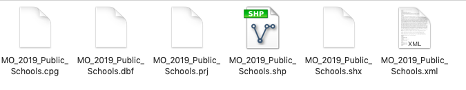

## Unit 2: Finding and Downloading GIS Data
### Unit Objectives
1. Identifying relevant websites to download GIS data for an area of interest.
2. Use relevant websites to download GIS data.

### Terms to know
- [Census block group](https://www2.census.gov/geo/pdfs/reference/GARM/Ch11GARM.pdf): The smallest geographic unit in which the Census unit collects census data. 
- TIGER Lines: Geographic features for all 50 states from the  *Topographically Integrated Geographic Encoding and Referencing* database(thus the acronym TIGER). Examples of TIGER line products are rivers, roads, and administrative boundaries such as counties.

#### GIS Data Sources: Where to go?
As mentioned in the [introduction](https://github.com/momiji15/yearntolearn/blob/master/library_research_workshops/QGIS/Intro_to_QGIS_Vector_Data/intro_to_qgis_vector_intro.md
), our final project will be a map that displays schools in St. Louis city and shows the student to teacher ratio by census block group. So the GIS data we will need are as follows:
1. public schools in St. Louis city.
2. Census block group data for St. city.

So where do we start? Let's work our way down this short list.

##### Schools data
[The Missouri Spatial Data Information Service(MSDIS)](http://msdis.missouri.edu/) has a variety of spatial data over the state of Missouri, including our schools data.
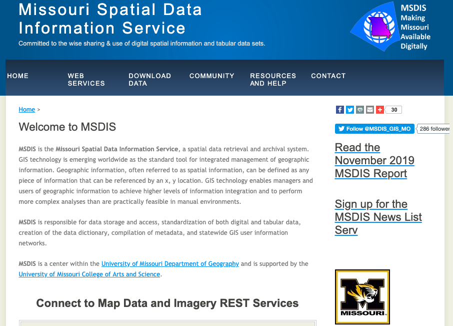

1. Go to the MSDIS website.
2. Under the **Download Data** dropdown menu, click on **Data Portal**. 
3. Scroll down on the site and click on the **Education** icon.

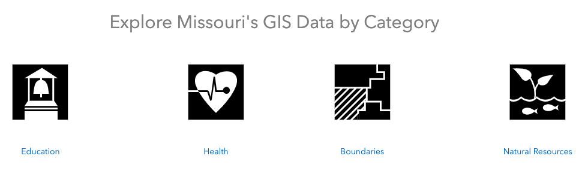

4. You will see three results. Scroll down and you will see **MO 2019 Public Schools**. Click on the text and you will be directed to a page that shows you a preview of the data along with the various attributes of the data. On the right side of the page, click on the **Download** button which will display a drop-down menu. Click on shapefile and the file will automatically download. 

5. Before we move the data from the Downloads folder, we need to make a folder on your Desktop to store your GIS data. File management is essential to GIS and it is important to implement sound data management skills for GIS project management. You will learn such skills throughout this workshop. Create a folder and name it **GIS_Data**. It is important to not use spaces in naming your folders and files due to readability issues that could occur later on. Make sure to use an underscore in place of a space to prevent any problems down the road. Also, notice that **MO_2019_Public_Schools** also use underscores in place of spaces in the zipped file.

6. After creating your folder, move the **MO_2019_Public_Schools** shapefile to your **GIS_Data** folder.

##### Census Tracts

You can get census data through the [Census' data portal](data.census.gov), but for this workshop, we will be using NHGIS, which uses census data. An easy way to get the block group shapefiles and the corresponding csv files that you need for this workshop is through the [IPUMS NHGIS](https://www.nhgis.org)website. The advantage of using NHGIS data is that it is already formatted so you can easily join the csv files to your shapefiles which you will be doing later on in this workshop. You should have registered for an NHGIS account before the workshop, but if not, please do it now. 

1. Navigate to the NHGIS website and click on the **Get Data**  button.

2. Click on the **Geographic Levels** button. Under **Most Popular**, click the green round button next to **Block Group**. It should turn into a checked checkbox.

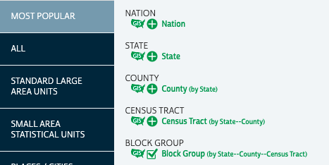

3. Click on the **Years** button. Under **5 Year Ranges** click **2013-2017**.

4. Click on the **Topics** button. In the **Table Topic Filter** section, click on the green round button next to **Total Population**. It should turn into a checked checkbox. Scroll down and click on the outer-most green round button next to **Poverty (Income Relative to Poverty Level)**. You should see your selected topic filters on the top of the **Topics** window under **Selected Topic Filters**.

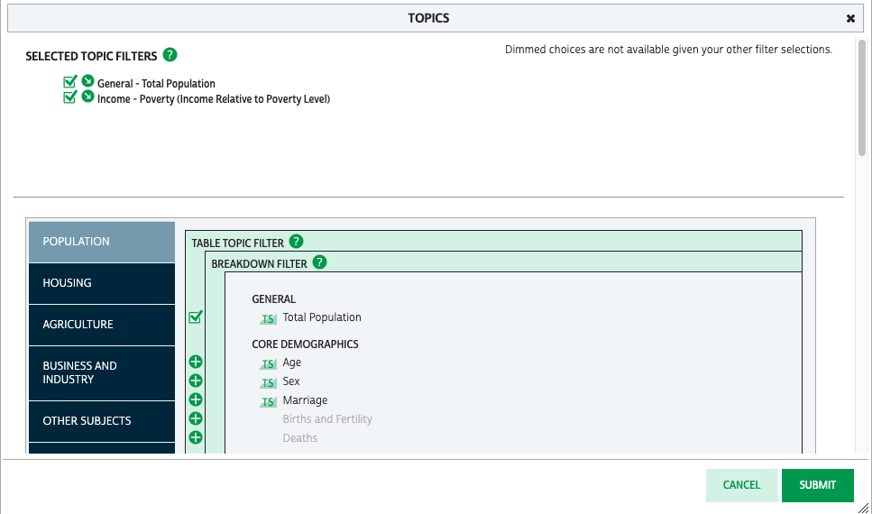

5. Your results should look like this: 

6. We will need to get the appropriate source table and GIS file. Under **11 Source Tables** click the green round button next to **B01003 Total Population** and **Ratio to Income to Poverty Level in the Past 12 Months**. In the **Data Cart**, which is located on the top right-hand corner, you will see that your selected source table as added to the cart.

7. Now click on the **53 GIS Tables** tab. Find the GIS table for Missouri and click on it. You will see that your **Data Cart** includes the GIS file that you just selected.

8. In the **Data Cart**, click on the **Continue** button. Confirm that for **Source Tables**, you have 2017 American Community Survey: 5-Year Data \[2013-2017, Block Groups & Larger Areas]	and for **GIS Tables**, you have **block group** for the **Geographic Level**, **Missouri** as the **Extent**, and **2017 TIGER Line/+** as the **Basis**. After confirming, click **Continue**.

9. In the **Review and Submit** section, keep everything as is, with the exception of **Geographic Extents** under the **Source Table** section. You will need to select a geographic extent for the source table to ensure you just get the total population for Missouri. Click on the **Geographic Extents** button, select **Missouri**, and then click **Submit**.

10. Click **Submit** in the **Review and Submit** section. You will be directed to an **Extracts History** page in which you will be able to see your download history. Since the source table and GIS data retrieval process is automated, it might take some time. You will receive an e-mail when your data extract is ready. You can download it through the link provided in the e-mail or continue to refresh the page until you see a **Complete** status. Click on **tables** to download the data table and click on **gis** to download the GIS data. Make sure to save it to your GIS_Data folder.

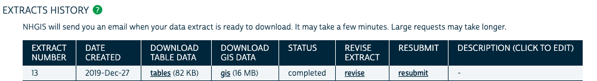

11. Unzip your downloaded files. If you are using a Mac, you will **right-click > Open With > Archive Utility(default)**.
If you are using Windows, you will **right-click > Extract All**.   **NhgisXXXX_csv.zip** has the csv file with the total population counts while **nhgisXXXX_shape.zip** is the shapefile that contains the Missouri block groups. The XXXX in the file name refers to the extract number of the file which you can see on the **Extract History** page.  Double-click on the **nhgisXXXX_shape.shp** folder and unzip **nhgisXXXX_shapefile_tl2017_290_blck_grp_2017.zip**. 
**
## Unit 3: Prepare GIS Data in a QGIS Workspace

### Unit Objectives
1. Adding vector data to a QGIS workspace.
2. Adding a csv file to a QGIS workspace.
3. Adding projections to your vector data.

### Terms to Know
- projection: A mathematical function that transforms the earth's 3D surface on a 2D surface.
Now that you have unzipped your data, it is not ready to put your shapefiles in a QGIS workspace.

1. Open up QGIS.

2. On the top menu bar, go to **File > New** to open a new workspace. You can also click on the left-most icon that looks like a blank sheet of paper to open a new workspace.

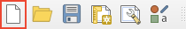

3. Now, you will add the Missouri public schools and census block group shapefiles to your workspace. Press the **Open Data Source Manager** button which is below the **New Project** button.

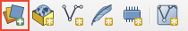

*Note: It is very important that you add the shapefiles in this order due to projection issues with the Census block group data.*

4. We are going to add the schools first. Make sure that **Vector** is highlighted on the left menu panel on the **Data Source Manager**. Under **Source > Vector Dataset(s)**, click  **...** and navigate to the location of your shapefiles which should be in the **GIS_Data** folder. Navigate to the **MO_2019_Public_Schools** folder, click on **MO_2019_Public_Schools.shp**, and click **Add**.  In the Data Source Manager, click **Add**.

5. Now we're going to add the Census block groups. Again, click on the **...** under **Source and Vector Dataset(s)** and navigate back to your GIS_Data folder and then navigate to the  **nhgis0013_shape folder > nhgisXXXX_shapefile_tl2017_290_blck_grp_2017nhgis** folder and then select **MO_blck_grp_2017.shp**, and click **Add**. In the Data Source Manager, click **Add**.

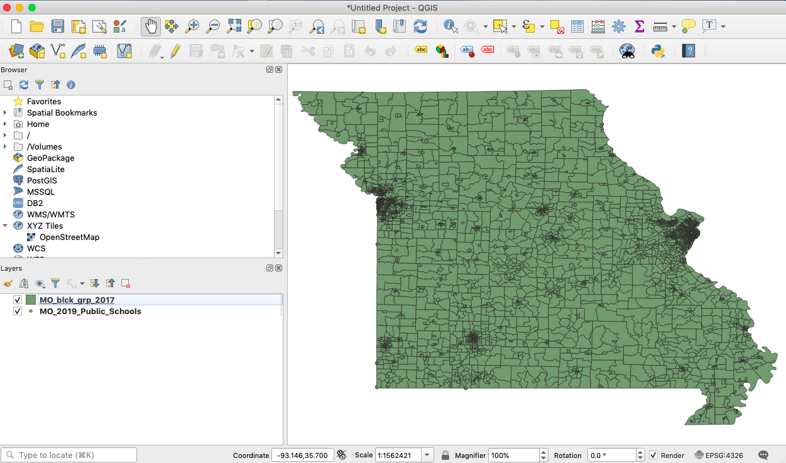

6. Your workspace should look similar to this. Don't be concerned about the colors of the shapefiles in your workspace being different than what you see here. If you don't see the schools, then they are probably below your block groups.  You can see the drawing order of your shapefiles in the **Layers** section. Since **MO_2019_Public_Schools** is below **MO_blck_grp_2017**, then you will not be able to see this shapefile. Click on **MO_2019_Public_Schools** and drag it on top of **MO_blck_grp_2017**. 

7. Before we proceed, we need to save the document. On the top menu bar, click on **Project > Save** and navigate to your **GIS_Data** folder. In **Save as**, name the workspace **stl_schools** and click **Save**. On the top of the Window, you should see the name of your workspace.

8. We need to add a projection to our project. At times, you can easily tell that the data is not projected for the boundaries look distorted and the edges of the boundaries are straight lines. To project our data, we will export each shapefile and create a new layer with our new projection.

9. On the bottom right-hand corner of the QGIS project window, you will see a button that says **EPSG: 4326**. Click the button.
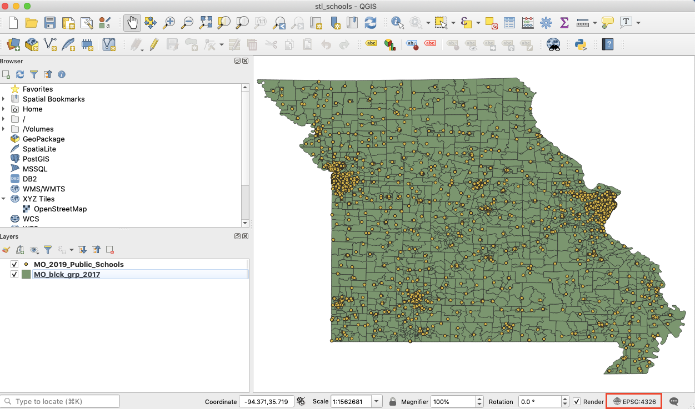

10.  This will display the **Project Coordinate Reference System (CRS)** window. In **Filters**, type **102696**. Under **Coordinate Reference Systems of the World** should see **NAD_1983_StatePlane_Missouri_East_FIPS_2401_Feet** which you can confirm for the EPSG is indeed **102696**. Click on the coordinate system and then click **OK**. 
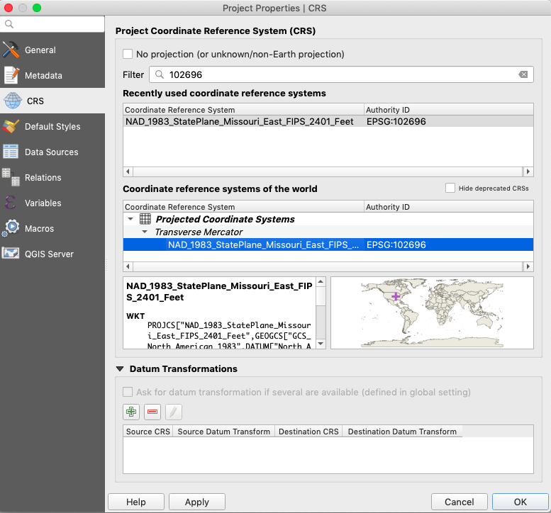

As you can see, the shapefiles have changed and are no longer distorted. You can also see that the projection of the QGIS project is in the correct projection indicated by the **EPSG: 102696** in the bottom right-hand corner. Save your project.
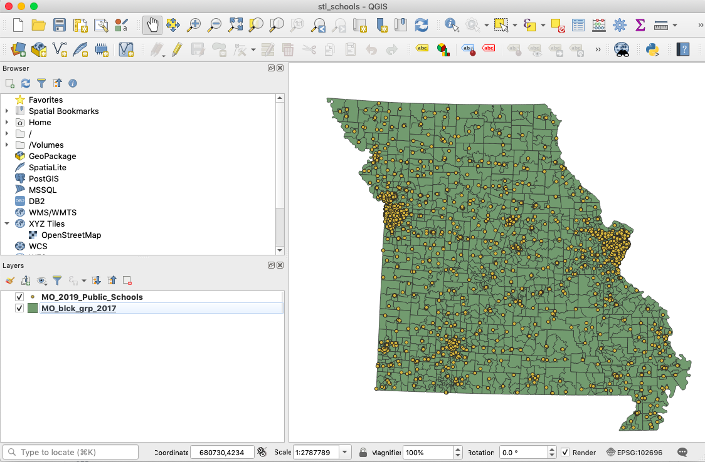

This projection was on-the-fly; while the project's projection changed, the shapefiles projection is not the same as the project's projection. Let's change that.

11. Let's first project the **MO_2019_Public_Schools** shapefile. Right-click on the shapefile and click **Export > Save Features As**.

12. Keep the **Format** as an **ESRI Shapefile**. Click the **...** next to the text box under **File Name**, navigate to your **GIS_Data** folder and then **MO_2019_Public_Schools** folder. Name your new layer **MO_2019_Public_Schools_Project**. 

13. Click the **Select CRS** button in **CRS**. Under **Filter**, type **Missouri** to get to the projection that we need. Under **Coordinate Reference Systems of the World**, highlight **NAD_1983_StatePlane_Missouri_East_FIPS_2401_Feet**. Click **OK**.

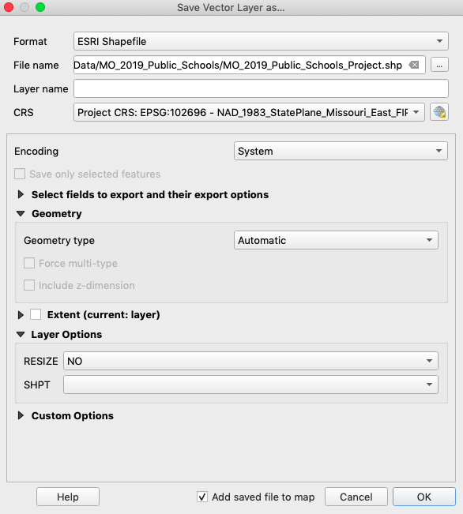

14. Click **OK** in the **Save Vector Layer as...** dialogue box. You will see your newly created shapefile in the Layers section.

15. Now we will do the same with the Missouri census tracts. Right-click on the shapefile and click **Export > Save Features As**.

16. As with **MO_2019_Public Schools**, you will keep the format to **ESRI Shapefile**. Navigate to your **GIS_Data** folder and then to  **nhgisXXXX_shape > nhgisXXXX_shapefile_tl2017_290_blck_grp_2017**. Name your new layer **MO_blck_group_2017_Project**.

17. Click the **Select CRS** button in **CRS**.

18. Under **Recently Used Coordinate Systems**, you should see the projection that you just used. Click on **NAD_1983_StatePlane_Missouri_East_FIPS_2401_Feet** and click on **OK** and then **OK** in the **Save Vector Layer as...** dialogue box. Your newly created layer will show up in the Project window and under the Layers panel. 
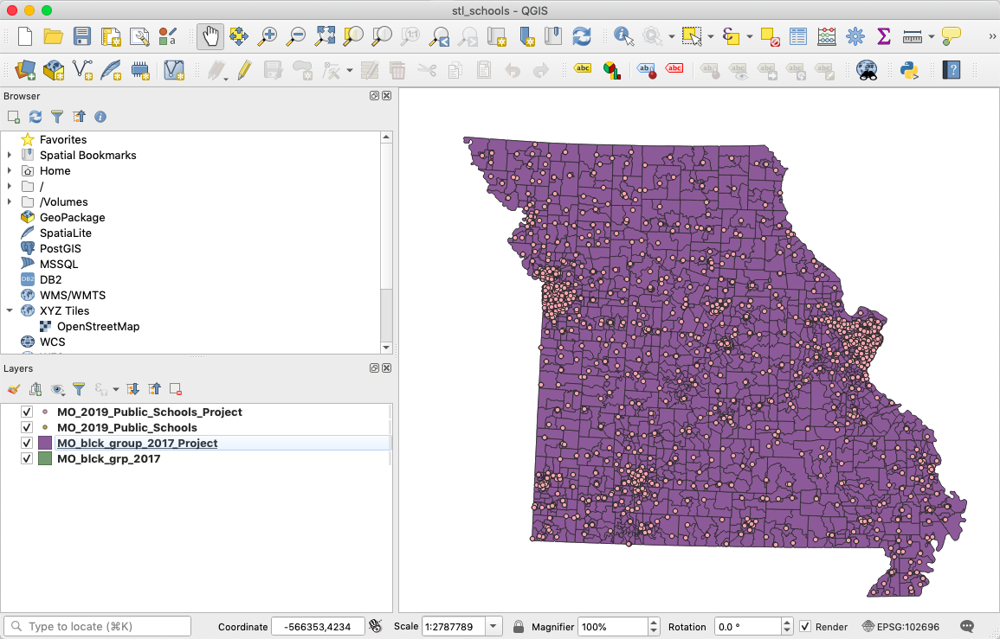

19. In the **Layers** panel, uncheck **MO_2019_Public_Schools** and **MO_blck_grp_2017**. Right-click on each of these files and click **Remove Layer**.

Congratulations! You just finished importing all the data you need into QGIS.

## Unit 4: Producing Basic Queries

### Unit Objectives
1. Produce a *select features by expression* query.
2. Produce a *select features by location* query.

### Terms to know
- FIPS code: A numbers which uniquely identifies a geographic unit such as a county or state. FIPS stands for *Federal Information Processing Standard*. State level FIPS codes have two digits while county level FIPS codes have five digits in which the first two digits are the state FIPS code. 

With QGIS, you can select features either by expression or by location. When you select features by expression, you are selecting a features of vector data based on a particular attribute such as all of the census block groups in a specific county. When you select features by location, you can select features of vector data based on their location, such as selecting all the cenus block groups that are contained within a St. Louis City polygon. Let's give both a try.

#### Producing a select features by expression query 
1. Right-click on **MO_blck_group_2017_Project** and click on **Open Attribute Table**.

2. As you can see, a database underlies this polygon dataset in which there are records for each feature contained in the s
   dataset. You can see this by clicking on the number for the first record and right-click the value that is in 
   **STATEFP**. Then click on **Zoom to Feature** which zooms into the feature and highlights it as well. 
3. To zoom out to see the entire Missouri block groups, click on the **Zoom to Layer** button in the QGIS toolbar.

4. Let's select the census block groups that are in St. Louis City by using an expression. There are two ways you can do 
   this: 
   Option 1: Open the attribute table and click on the **Select features using an expression** button that is on the 
   the attribute table toolbar.
    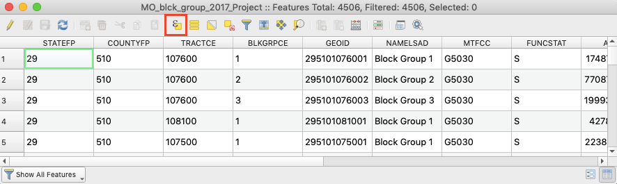
    
   Option 2: Click on the **Select by Expression** button on the QGIS toolbar.
   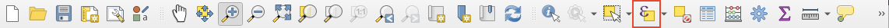
   
5. Using either option in #4, click on **Select by Expression**. We will be selecting St. Louis City block groups by County FIPS codes which is listed as **COUNTYFP** in the attribute table. Since St. Louis City is its own administrative unit separate from St. Louis county, it has it's own FIPS code which is **510**.
 
6. Let's create the query. In the middle box, click on **Fields and Values** and double-click **COUNTYFP**. You should see `COUNTYFP`appear in the Expression box on the left.

7. Click on the `=` button located in the toolbar above the Expression box. You should see `=` appear in the Expression box.

8. In the right box under **Values**, click on **All Unique** which will show all of the values that are in the **COUNTYFP** field. Scroll down until you find **510** and double-click on it. Your expression should look like this:

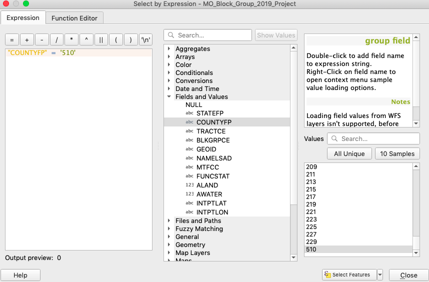

9. Click **Select Features** and 360 features should be selected. Click **Close** to close the Expression box. You might not see the selected features, so click on the **Zoom to Selection** button which is to the left of the **Zoom to Layer** button. You should see all of the city of St. Louis selected.

10. We're going to export those selected block groups which will result in creating a new shapefile. Right-click on **MO_blck_group_2017_Project** > **Save Selected Features As...**

11. Keep the **Format** as an **ESRI Shapefile** and for **File name**, click on the ellipses(...) and navigate to your GIS_Data folder. Create a new folder called **stl_bg** and navigate to your folder. You will save your shapefile here. Give your shapefile the same name as the folder that you just created. Make sure that the **CRS** is the **Project CRS: EPSG 102696 - NAD_1983_StatePlane_Missouri_East_FIPS_2401_Feet**. Keep everything else the same and press **OK**. 
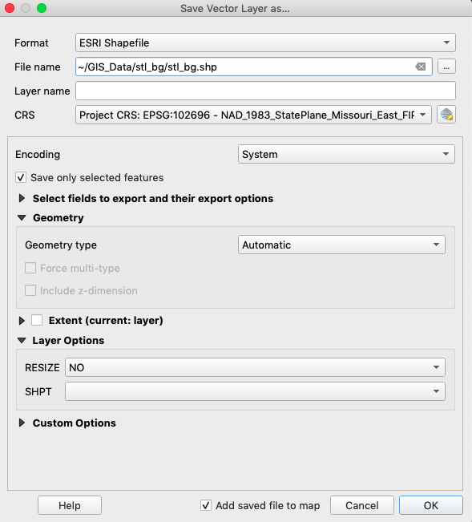
*Note that the file extensions will be different for you than what you see in the picture above*

12. Your newly created shapefile is added to the layers panel. Save your QGIS project.

#### Producing a select by location query
Now that we have the St. Louis City census tracts, we can use it as a "cookie cutter" of sorts and select schools that are in St. Louis City. We can do this by producing a select by location query. 

1. In the QGIS menu var, click on **Vector** > **Research Tools** > **Select by Location**.

2. Under the drop-down menu in **Select features from**, choose **MO_2019_Public_Schools_Project**. Under **Where the features(geometric predicate)**, only check the box for **intersect**. Under **By comparing to the features from**, choose **stl_bg** from the drop-down menu. Finally, under **Modify current selection by**, make sure **creating new selection** is selected. Click **Run** to run the query. All of the schools within stl_bg should be selected.

3. As we did previously, we will export the selected features into a new shapefile. Right-click on **MO_2019_Public_Schools_Project** and click **Export** > **Save Selected Features As...**. 

4.Keep the format as **ESRI Shapefile** and make sure to set the CRS to Missouri State Plane East.  For the **file name**, make sure to navigate to the **GIS_Data** folder, create a new folder called **stl_schools** and save your shapefile with the same name in that folder. Press **OK** and you should see **stl_schools** under the Layers pane in your QGIS project.  Save your project.

## Unit 5: Joining Tablular Data to Vector Data
### Unit objectives
1. Identify key fields fields between two different datasets.
2. Generate a join between a csv file and a shapefile.

### Terms to know
- key: a field that is common to two different datasets.

Our shapefile of St. Louis block groups does not have any socio-economic data attached to it. We can join the .csv file that we downloaded from NHGIS based on a field that is common to both data, which is called a key. The key that we will use to join the .csv file to the shapefile is **GISJOIN**. 

1. Let's add the csv file to our project. Click on the **Open Data Source Manager** button and on the left-hand panel, click on **Delimited Text**. 

2. Click on the **...** button next to File Name and navigate to **GIS_Data > nhgisXXXX_csv > nhgisXXXX_ds233_20175_2017_blck_group.csv**. 

3. Let's give our csv file a more simplified name when it displays in QGIS. In the **Layer name** type **stl_blck_grp_table**. Keep the rest of the defaults and click **Add** then **Close**. You will see **stl_blck_group_table** in the Layers panel.

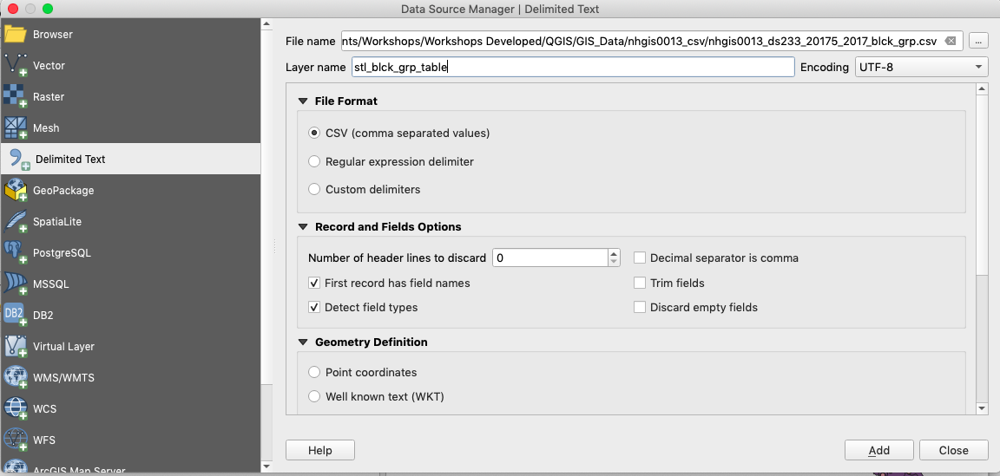

4. We are now going to join **stl_blck_grp_table** to **stl_bg**. The way that tabular data is able to be joined to the polygons is through joining them by a field that is located in both attribute tables. This common field is known as a **key**. Let's see which field is both common in both data sources. Right-click on **stl_blck_grp_table** and click on **Open Attribute Table**. Do the same for **stl_bg**. From looking at both datasets, **GISJOIN** is the common field in these datasets. Close both attribute tables.

5. Right-click **stl_bg** and click on **Properties...**. Click on **Joins** in the side panel of the Layer Properties window. Click the green plus button on the bottom to add a join to the polygon data.

6. In the **Add Vector Join** window, choose on **stl_blck_grp_table**  from the drop-down menu as the **Join Layer**. For the **Join field** and **Target field** drop-down menus, chose **GISJOIN**. Check the the **Custom Field Name Prefix** box and remove the text that is in the text box. Click **OK**. 

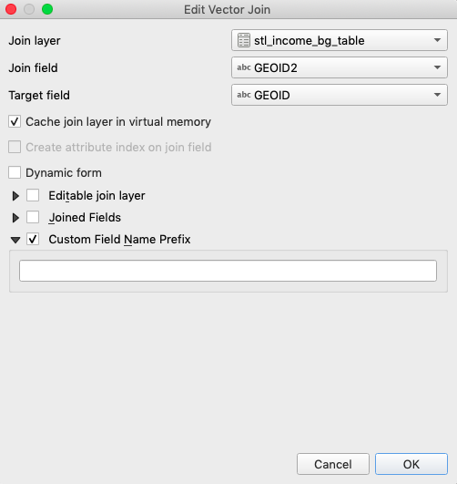

You can see in the Layer Properties window that **stl_blck_grp_table** was joined to **stl_bg**. Click **OK** to exit out of the Layer Properties window.

7. Right-click on **stl_bg** and click on **Open Attribue Table**. If you continue to scroll to the right, you will eventually see the joined fields. Don't be too concerned with any blank fields; the field you only need to concern yourself with is AHY1E001 which is the total population of people per Census block group and AH1JE008 which is the ratio of income to poverty level that is 2.00 and over. You can find out the meaning of each field by looking at the **codebook file(nhgisXXXX_ds233_20175_2017_blck_grp_codebook.txt)** that is located in **nhgisXXXX_csv**.

## Unit 6: Computing values with Field Calculator
### Unit Objectives

1. Produce field calculations with pre-existing fields.

With the field calculator, you are able to make new fields based on doing calculations with already existing fields. Let's perform a field calculation with the **stl_schools** and the **stl_bg** layers.  We're going to calculate the student and teacher ratio in the **stl_schools** layer and percentage of people in which the income to poverty ratio is over 2.00 in **stl_bg**. 

1. Right-click on **stl_schools** and click on **Open Attribute Table**. In the top attribute table toolbar, click on the **Open Field Calculator** button which will open the Field Calculator window. 

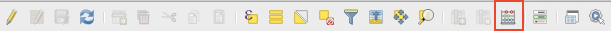

2. In the Field Calculator window, make sure that the **Create a new field** box is checked. The **Output field** name should be **ST_Ratio**, the **Output field type** should be **Decimal number(real)** and the **Output field length** should be **10**. Under the **Expressions** box, you want to divide the **Teachers** field by the **Enrollment** field. In order to find the **Teachers** and **Enrollment** values, click on **Fields and Values** in the middle box in which you will see all of the fields in the attribute table. Once you confirmed these parameters, then click **OK**.

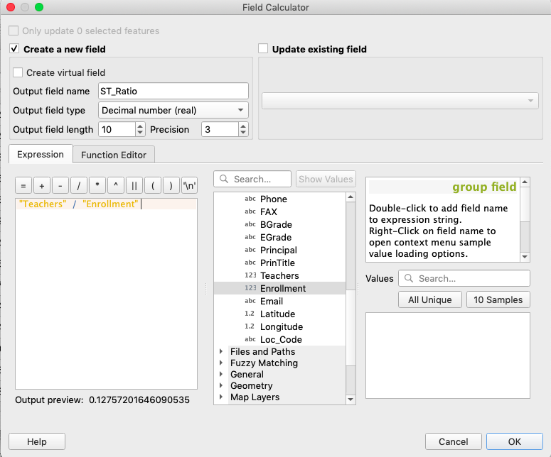

3. Right-click on the **stl_schools** layer and open the attribute table. If you scroll to the end of the attribute table, you should see **ST_Ratio**. Close the attribute table.

4. Let's calculate the percentage of people who have an income to poverty ratio of 2.0 and over by Census block group. Right-click on **stl_bg** and open the attribute table. Click on the **Open Field Calculator** button.

5. In the Field Calculator window, make sure that the **Create a new field** box is checked. The **Output field** should be **pct_gt_t2**. In the Field Calculator window, the **Output field type** should be **Decimal number(real)** and the **Output field length** should be **10**.

6. Let's create the expression. Open up the code book for your **nhgisXXXX_csv** file. The fields that we are going to be concerned with is **AH1JE008** which is the population of those who has a ratio of income to poverty level over 2 and **AH1JE001** which is the total population of the block groups. You're going ot divide **AH1JE008** by **AH1JE001**. Click on those fields in the **Fields and Values** section to make the expression. Once you confirmed these parameters, then click **OK**
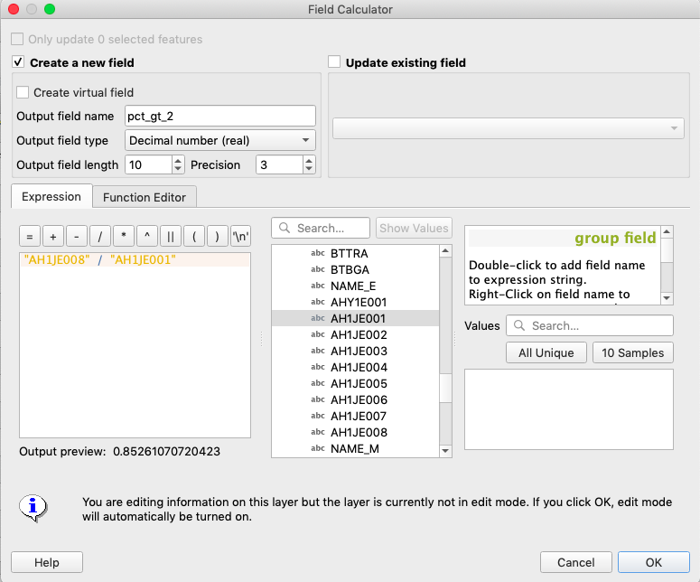

7. Confirm that your newly created field is in the attribute table by right-clicking on **stl_bg** and opening the attribute table.

8. If you want, feel free to do more field calculations to determine the percentage of population of individuals per block group with a specific income to poverty level ratio.

Now we have everything we need to create our map. Congratulations! You finished Part 1! Proceed to Part 2 to learn how to symbolize and design your map.

