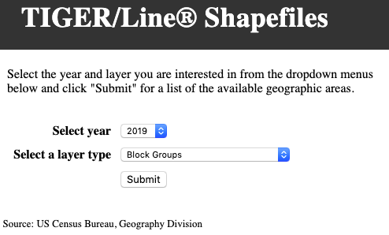

# Introduction to QGIS - Vector Data: Part 1

## Units
### Unit 1: Introduction to Vector Data
### Unit 2: Finding and Downloading GIS Data
### Unit 3: Prepare GIS Data in a QGIS Workspace
### Unit 4: Producing Basic Queries 
### Unit 5: Joining Tabular Data to Vector Data
### Unit 6: Computing values with Field Calculator

## Unit 1: Introduction to Vector Data
### Unit Objectives
  1. Define Geographic Information Systems (GIS) 
  2. Describe the two types of GIS data.
  3. List three types of GIS vector data.
  4. Describe the structure of GIS data.

### Terms to know
- Geographic Information Systems(GIS): A computer system that is used to capture, display, and analyze data that has a spatial reference on Earth.

- vector data: GIS data that represents data on the earth through points, lines, and polygons.

- raster data: GIS data that represents data on the earth through a grid of pixels.

- shapefile: A file format for vector data, which comprises of at least four different file types.

#### GIS, Vector and Raster GIS Data
Geographic Information Systems (GIS) is a very powerful tool when it comes to understanding physical and socio-cultural processes on the earth. There are various types of GIS software out there, however a common thread with the software is the data they deal with. GIS uses vector data and raster data to represent features on the earth. Vector data is made up of points, lines and polygons. An example of point data could be a points representing school locations (which you will see in today's workshop). An example of line data could be lines representing rivers and streams. Finally, an example of polygon data could be school districts.

On the other hand, raster data is a grid of pixels in which each value represents a feature on the earth. For example each pixel of a raster image of a forest profile could represent the type of tree in the forest. For today's workshop we will be exclusively focusing on vector data. The GIS software that we will be using today is Quantum GIS, also known as QGIS. QGIS is a very convenient software, for it is available for both Mac and Windows machines and it is free and open source. 

One of the file formats that represent vector data is a shapefile, which is actually made of up of various filetypes such as .shp, .shx, .dbf, .prj, and .xml. We will be working with shapefiles for this workshop. The reason that shapefiles are made up of various files is due to the nature of vector data. Vector data is not just visual in nature; a database underlies vector data which in which each point, line, and polygon is represented by a record in a database. In addition, a shapefile might contain metadata, which is data about data. In short, metadata gives you information about how the shapefile was derived.

## Unit 2: Finding and Downloading GIS Data
### Unit Objectives
1. Identifying relevant websites to download GIS data for an area of interest.
2. Use relevant websites to download GIS data.

### Terms to know
- [Census block group](https://www2.census.gov/geo/pdfs/reference/GARM/Ch11GARM.pdf): The smallest geographic unit in which the Census unit collects census data. 
- TIGER Lines: Geographic features for all 50 states from the  *Topographically Integrated Geographic Encoding and Referencing* database(thus the acronym TIGER). Examples of TIGER line products are rivers, roads, and administrative boundaries such as counties.

#### GIS Data Sources: Where to go?
As mentioned in the [introduction](https://github.com/momiji15/yearntolearn/blob/master/library_research_workshops/QGIS/Intro_to_QGIS_Vector_Data/intro_to_qgis_vector_intro.md
), our final project will be a map that displays schools in St. Louis city and shows the student to teacher ratio by census block group. So the GIS data we will need are as follows:
1. public schools in St. Louis city.
2. Census block group data for St. city.

So where do we start? Let's work our way down this short list.

##### Schools data
[The Missouri Spatial Data Information Service(MSDIS)](http://msdis.missouri.edu/) has a variety of spatial data over the state of Missouri, including our schools data.

1. Go to the MSDIS website.
2. Under the **Download Data** dropdown menu, click on **Data Portal**. 
3. Scroll down on the site and click on the **Education** icon.

4. You will see three results. Scroll down and you will see **MO 2019 Public Schools**. Click on the text and you will be directed to a page that shows you a preview of the data along with the various attributes of the data. On the right side of the page, click on the **Download** button which will display a drop-down menu. Click on shapefile and the file will automatically download. 

5. Before we move the data from the Downloads folder, we need to make a folder on your Desktop to store your GIS data. File management is essential to GIS and it is important to implement sound data management skills for GIS project management. You will learn such skills throughout this workshop. Create a folder and name it **GIS_Data**. It is important to not use spaces in naming your folders and files due to readability issues that could occur later on. Make sure to use an underscore in place of a space to prevent any problems down the road. Also, notice that **MO_2019_Public_Schools** also use underscores in place of spaces in the zipped file.

6. After creating your folder, move the **MO_2019_Public_Schools** shapefile to your **GIS_Data** folder.

##### Census Tracts
Now it's time to download your census tracts. You can do this from the [Census Bureau TIGER/Line Shapefiles](https://www.census.gov/cgi-bin/geo/shapefiles/index.php) website.

1. Go to the U.S. Census Bureau TIGER/Line Shapefiles website.

2. On the drop-down menu, in **Select Year**, select **2019** and in **Select a Layer Type** select **Block Groups**. Click **Submit**.

3. You will be prompted to another page in which you will need to choose the state. In the dropdown menu, choose **Missouri** and click the **Download** button. Move your downloaded shapefile to your **GIS_Data folder**.

4. To use the files in QGIS, you will need to unzip the folders. Right-click on **MO_2019_Public_Schools**, and unzip the file. If you are using a Mac, you will go to **Open With** and then **Archive Utility**. For Windows, after right-clicking, go to **Extract All** and follow the instructions. 

## Unit 3: Prepare GIS Data in a QGIS Workspace

### Unit Objectives
1. Adding vector data to a QGIS workspace.
2. Adding a csv file to a QGIS workspace.
3. Adding projections to your vector data.

### Terms to Know
- projection: A mathematical function that transforms the earth's 3D surface on a 2D surface.
Now that you have unzipped your data, it is not ready to put your shapefiles in a QGIS workspace.

1. Open up QGIS.

2. On the top menu bar, go to **File > New** to open a new workspace. You can also click on the left-most icon that looks like a blank sheet of paper to open a new workspace.

3. Now, you will add the Missouri public schools and census block group shapefiles to your workspace. Press the **Open Data Source Manager** button which is below the **New Project** button.

4. Make sure that **Vector** is highlighted on the left menu panel on the **Data Source Manager**. Under **Source > Vector Dataset(s)**, click  **...** and navigate to the location of your shapefiles which should be in the **GIS_Data** folder. Click on the **tl_2019_29_bg** folder and then select **tl_2019_29.shp**.  Click **Add**.

5. Now we're going to add the schools. Again, click on the ***...*** under **Source and Vector Dataset(s)** and navigate back to your GIS_Data folder and then to the **MO_2019_Public_Schools** folder and then select **MO_2019_Public_Schools.shp**. Click **Add**.

