# Introduction to QGIS - Vector Data: Part 2

The objective of part 2 is to create a map of student to teacher ratios by income to poverty ratios over two by block group. When it comes to creating a map, make sure that your map is suitable to the context. Realistically, this map would probably one out of a series of maps if I was concerned with the relationship of overall income/poverty ratios to student/teacher ratios. For the sake of this workshop, we will only create one map. Feel free to make more maps to find out more about this relationship with your newly acquired knowledge! 

## Units
### Unit 1: Basic Cartographic Elements
### Unit 2: Symbolizing Layers
### Unit 3: Creating and Exporting a Map Layout

### Terms to Know:
- chloropleth map: A map in which color is used to represent value over a specific area. 
- color hue: Refers to different colors, such as blue and green.
- color value: Refers to different shades of one hue such as dark blue and light green. Colors become darker by adding
  black to the hye, and colors become lighter by adding white to the hue.
- color intensity: Also known as saturation. This is the brightness of the color. Adding colors can make the hue less
  intense. For exmaple, adding grey to a hue can make it less intense. If you are having issues differientating value from 
  intensity, you can think of intensity as how different or similar a color is from grey.
- ordinal data: Data that has an order to it. 

## Unit 1: Basic Cartographic Elements
### Unit Objectives
1. Identify basic cartographic elements of a map.
2. Identify symbolization considerations for symbolizing quantitative data.

#### Lesson 1: Identifying Basic Cartographic Elements of a Map

Before we start making our map, it's important to understand basic cartographic elements of a map. Most maps have these common cartographic elements:

  - data frame: In QGIS, this is called a **Map**. It is the space in which your layers are located.
  - title: It's important to have a title for your map. It sets the context of which your map was made. This is especially
    important if you are creating a series of maps.
  - north arrow: The north arrow is added for orientation purposes. While most maps are orientated north, there are 
    exceptions to this.
  - legend: This is a reference to the layers and indicates what each layer is along with the representation of any color
    schemes that are applied to the layer.
  - Citation: It is very important to include your information along with citing the sources of your data. You want to 
    include your information for various reasons. Examples are knowing who to contact when there are questions about the
    map and giving credit where credit is due if the map is used in another person's presentation or report. You must also
    give proper attribution to the data sources that you used by citing them. 
    
Make sure to include all of these elements in your map.

#### Lesson 2: Identify Symbolization Considerations for Symbolizing Quantitative Data

In addition to including the necessary cartographic elements, it is also important to identify the appropriate color schemes for symbolizing your chloropleth map. 

## Unit 2: Symbolizing Layers
### Unit Objectives
1. Selecting an appropriate color scheme for polygon data.
2. Producing a symbology by size for points data.

#### Lesson 1: Selecting an Appropriate Color Scheme for Polygon Data
Using what we learned in the previous lesson, lets add some symbolization to our point and polygon data. Our final product will be a chloropleth map which shows the relationshop of the student to teacher ratio to the number of individuals in block groups who have an income to poverty ratio over two.  Let's start first with the polygon data. 

1. Right-click on **stl_bg** and click on **Properties**.

2. In the left-hand panel, click on **Symbology**.

3. On the top of the Layer Properties window you will see a drop-down menu in which **Single symbol** is the default. Click on it and choose the **Graduated** option.

4. For **Value**, choose **pct_gt_2** from the drop-down menu.

5. You can leave the **Color Ramp** to the default color of **Reds** for now.

6. Click on the **Classify** button and you will see the data classified into five groups.
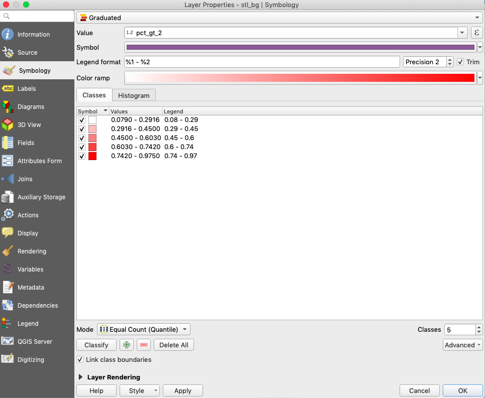

Take a closer look at the options of **Mode** towards the bottom of the Layer Properties window. You can classify your data in various ways which can be dependent on the distribution of the data, number of values, and the overall goal of the map. Here are some of the common classification schemes:

- [quantile scheme](http://wiki.gis.com/wiki/index.php/Quantile): When each class has the same number of data values. This scheme is recommended for ordinal data like values from a Likert Scale. While the advantage of this scheme is that there is an equal number of values in each class, the disadvantage is that dissimilar values might be put in the same class.

- [equal interval](http://wiki.gis.com/wiki/index.php/Classification) scheme: When each class is broken in regular intervals(for example, 10-20, 20-30, etc). The advantage of this scheme is that this scheme is great to use when comparing a series of maps, but the disadvantage of this scheme is that it does not take in consideration the distribution of the data.

- [natural breaks scheme](http://wiki.gis.com/wiki/index.php/Jenks_Natural_Breaks_Classification): A classification scheme that takes in consideration the distribution of data. This results in classes in which the differences in values are minimized. Class breaks are based on breaks in the data. The advantage of this scheme is that it takes in consideration the data distribution, but using this scheme isn't recommended for data with a low amount of variation.

7. Let's take a look at the distribution of data. Click on the **Histogram** tab, which is located under **Color Ramp**. 
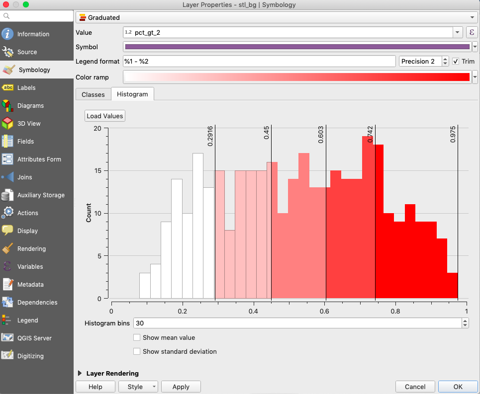

The data is close to a normal distribution. Let's choose **natural breaks** as the classification scheme.

8. Click on the **Classes** tab and in the drop-down menu for **Mode**, choose **Natural Breaks(Jenks)** and click **OK**. You will now see the block group polygons classified by color. The darker color signifies block groups with a high number of individuals who have an income to poverty ratio over two. 
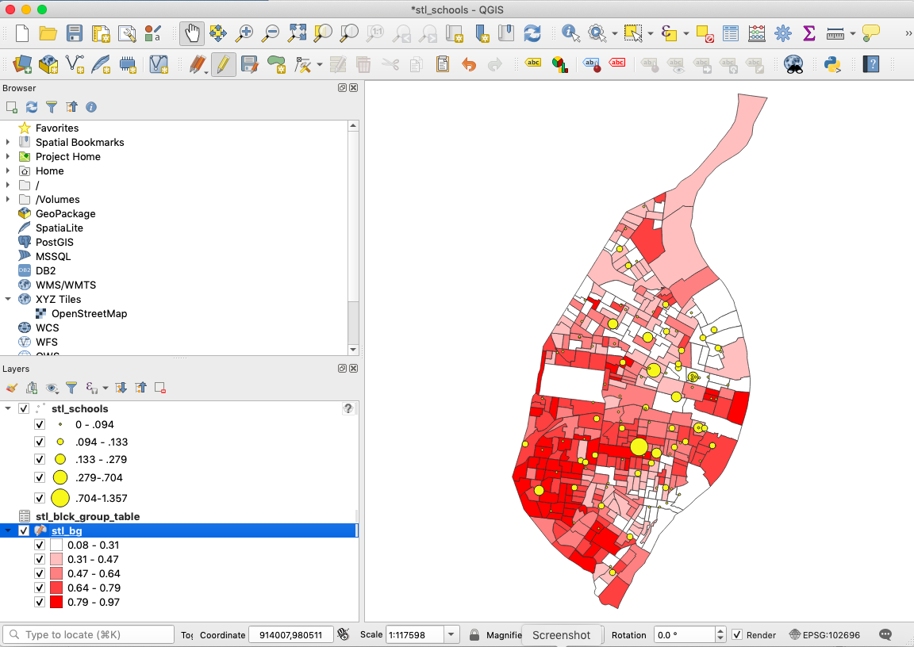

9. Make sure to save your document.

#### Lesson 2: Producing a Symbology by Size for Points Data
Now we're going to adjust the symbology of the points data to adjust the size of the points by the student teacher ratio(**ST_ratio**).

1. Right-click on **stl_schools** and click on **Properties**.

2. In the left-hand panel, click on **Symbology**.

3. On the top of the Layer Properties window you will see a drop-down menu in which **Single symbol** is the default. Click on it and choose the **Graduated** option. 

4. Let's change the color and size of the points. Click on the down arrow button in **Symbol** and choose a yellow color for your points. Under **Method** choose **Size**.

5. Click **Classify** on the bottom of the Layer Properties window. Keep the classification to **Natural Breaks (Jenks)** then click OK. Notice how the points data changed. Which parts of St. Louis has a high student to teacher ratio and a low student teacher ratio?
6. Make sure to save your document.

### Unit 3: Creating and Exporting a Map Layout
1. Generate a print layout for a map.
2. Create a map incorporating the basic cartographic elements.
3. Export a map in an appropriate file format.

#### Lesson 1: Generate a Print Layout for a Map

Now that we have symbology for all of our layers, it's time to create a map! 

1. Click on **Project > New Print Layout**.

2. Give your layout a title. Let's call it **Student teacher Ratio by Block Group**. Click **OK**. Another window will open up. This is the map layout window. 

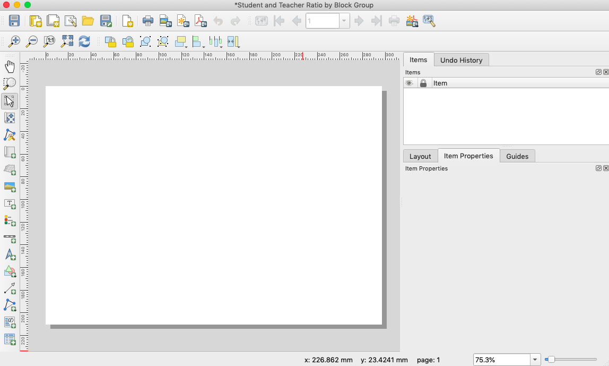

3. Let's change our page to portrait orientation. Right-click anywhere within the page and click on **Page Properties...**. On the right-hand side of the print layout window, you will see an **Item Properties** panel. Under **Orientation** click on **Portrait**. The page layout will then turn to portrait orientation. 

Before we move on, it's good to be acquainted with some of the buttons in the left-hand toolbar:
Here are some useful buttons to know in the left toolbar: 

- **Select/Move item** 
- **Move item content** 
- **Adds a new Map to the layout** 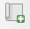
- **Adds a new Label to the layout** 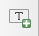
- **Adds a new Legend to the layout** 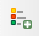
- **Adds a new Scale Bar to the layout** 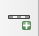
- **Adds a new North Arrow to the layout** 

 
4. Let's add our Map to the map layout. On the left toolbar, click on the **Adds a new Map to the Layout** button. Your pointer will turn into a cross. Left-click and drag a rectangle of appropriate size within your page layout. Make sure to leave enough room in your page for a **title** and **created by/data source** section, but make sure your rectangle is big enough to contain cartographic elements such as the **scale bar, north arrow, and legend**.

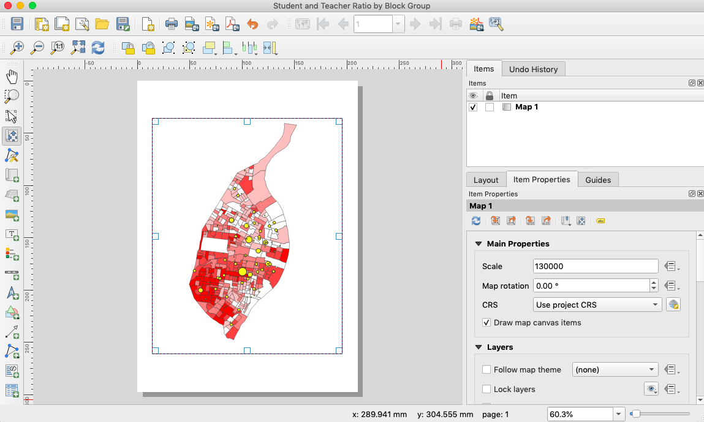

5. To add a title for your map, click on the **Adds a new Label to the layout** button. Left-click and drag a rectangle above your Map location. On the right-hand side in **Item Properties panel**, type *Exploring Student/Teacher Ratios in St. Louis City* under **Label**. If you can come up with a better title, feel free to do so!
 
6. Let's justify the font and alignment of the text. To change the size of the font, click on **Font** which is under **Appearance**. Change the font size to 28.  A little bit below **Font**, you will see the **Horizontal Alignment** option. Click on **Center**.

7. Another neccessary cartographic element is the legend. Click on the **Adds a new Legend to the layout** button. Left-click and drag a rectangle to the right of St. Louis city. We need to clean up the legend items so they can be more clear to those who look at the map.

8. In the **Item Properties** panel, scroll to the **Legend Items** section.  Double-click on **stl_schools** and rename the Layer **Student-to-Teacher Ratio**. Double-click on **stl_bg** and rename it **Block Groups**. We need to express each **% of Individuals with an Income/Poverty Ratio over Two** legend item by percentages. Change the legend items to reflect this by double-clicking on each legend item.

9. To get rid of **stl_blck_grp_table**, under **Legend Items**, uncheck the **Auto update** box. Highlight **stl_blck_group_table** and press the minus button at the bottom on the **Legend Items** box.
The layer is removed from the legend as a result.

10. Next, let's add the North arrow. Click on the **Adds a new North Arrow to the layout** button, left-click and draw a rectangle to the mid-right of the St. Louis city block groups.  In the **Item Properties** panel under the **Search Directories** section, you can find a variety of choices for North arrows. Under **SVG Parameters**, you can change the fill and stroke color of your North Arrow.

11. Finally, we need to add reference information about the map such as the name, date, and data source. It should look something like this:

Your Name
01/01/2020
Data Sources: NHGIS, MSDIS, US Census Bureau

Click on the **Adds a new Label to the layout** button, left-click and draw a rectangle on the bottom-left portion of your map. Enter your reference information in **Main Properties** under **Label** in the the **Item Properties** panel. Feel free to change the size or type of the font by clicking on the **Font** button under **Appearance**.

12. Feel free to adjust the map to make it more aesthetically pleasing. If you're happy with what you have then you're done!
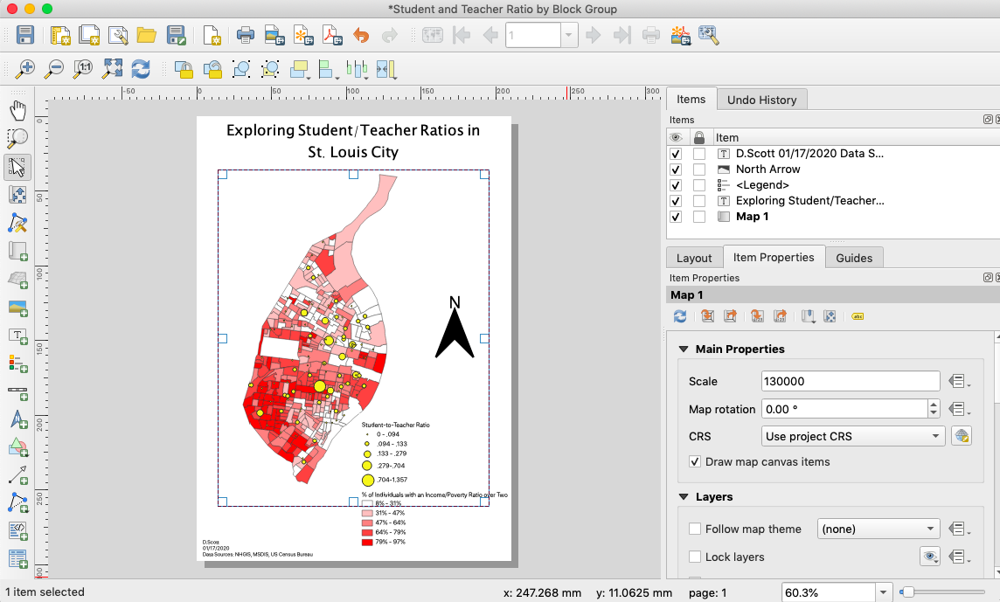

13. Once you're done with your map, you can export it in a variety of formats. Let's export it as an image. Click on **Layout > Export as Image**. Navigate to your GIS_Data folder and create a folder called **Maps**. Navigate to that folder and name your file **stl_map**. Click save, accept the defaults, and click save again. If your export is successful, you will get a message on the top of the layout window saying that the export was successful. 

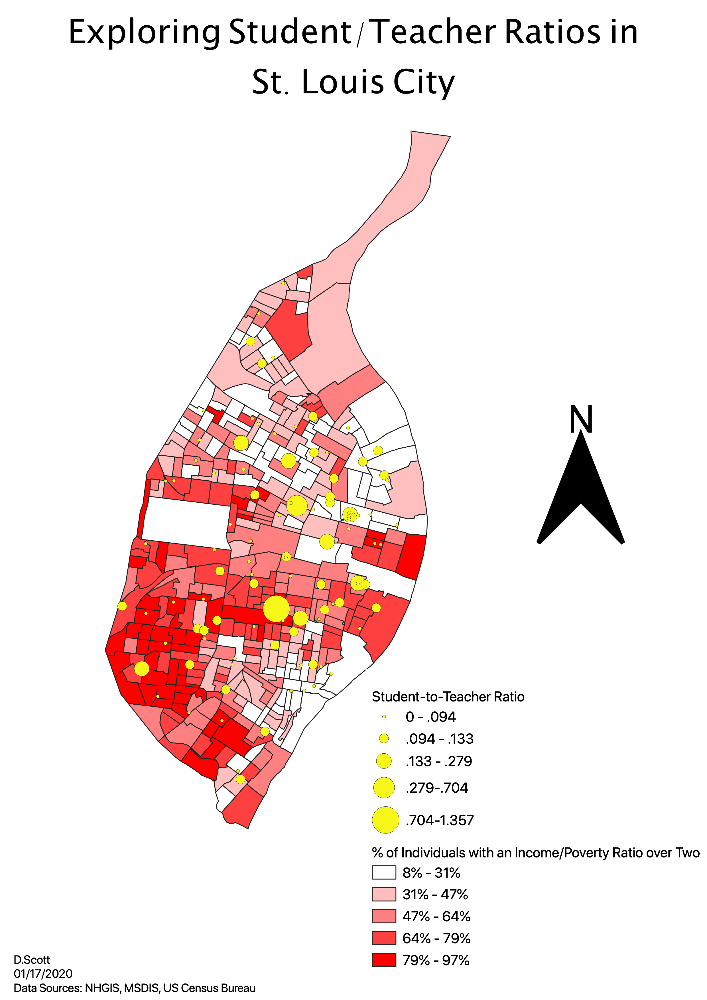

